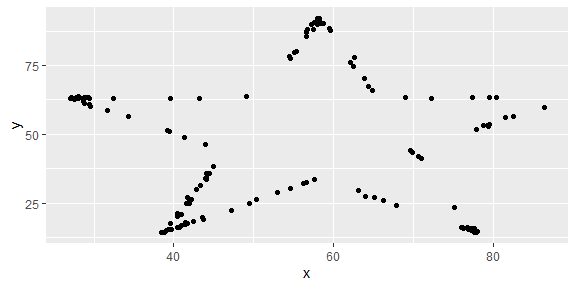

Lab 01 - Hello R
================
Yin Zhien
8/12/2022

## Load packages and data

``` r
library(tidyverse) 
```

    ## Warning: package 'tidyr' was built under R version 4.2.2

    ## Warning: package 'dplyr' was built under R version 4.2.2

``` r
library(datasauRus)
```

    ## Warning: package 'datasauRus' was built under R version 4.2.2

## Exercises

### Exercise 1

Based on the help file, there are 1846 rows and 3 variables. The
variables included in the data frame are dataset, x and y.

### Exercise 2

First, we plot the data in the dino dataset: \* Reminder, always load a
package!

``` r
dino_data <- datasaurus_dozen %>%
  filter(dataset == "dino")

ggplot(data = dino_data, mapping = aes(x = x, y = y)) +
  geom_point()
```

<!-- -->

And next, we calculate the correlation between `x` and `y` in this
dataset:

``` r
dino_data %>%
  summarize(r = cor(x, y))
```

    ## # A tibble: 1 × 1
    ##         r
    ##     <dbl>
    ## 1 -0.0645

### Exercise 3

Now let’s work on the star dataset.

``` r
star_data <- datasaurus_dozen %>%
   filter(dataset == "star")

ggplot(data = star_data, mapping = aes(x = x, y = y)) +
  geom_point()
```

<!-- -->

And now, we calculate the correlation between `x` and `y` in the star
dataset:

``` r
star_data %>%
  summarize(r = cor(x, y))
```

    ## # A tibble: 1 × 1
    ##         r
    ##     <dbl>
    ## 1 -0.0630

### Exercise 4

Add code and narrative as needed. Note that two R chunks are given but
they are not labeled. Use the convention from above to name them
appropriately.

### Exercise 5

Add code and narrative as needed.

To add R chunks either type out the backticks, curly braces, and the
letter `r` or use the Insert chunk button above, green C+.

## Bonus Tips by Yoo Ri

Here are some helpful tips :)

- filter() is for extracting rows

- group_by() is for grouping datasets by assigned column

- ungroup() cancels the grouping

- summarize() is often used with group_by(). This function can print the
  output according to the group_by().

- facet_grid(y\~x,…) creates a grid with variable y as a row, variable x
  as a column  

- facet_wrap(x,… ) is useful when there is only one variable
